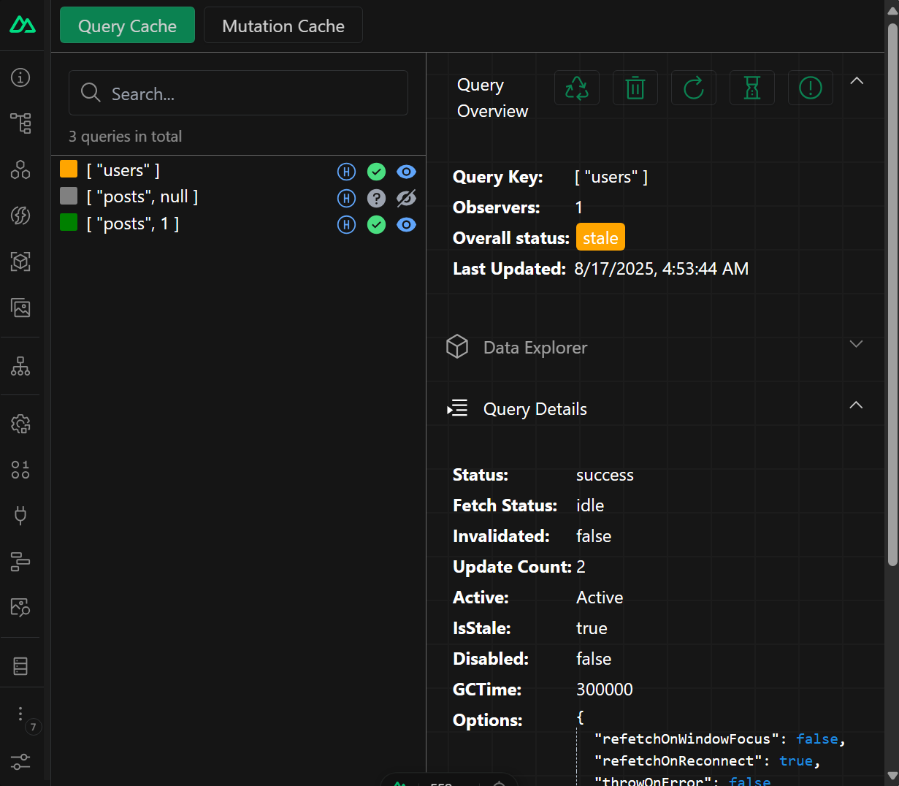
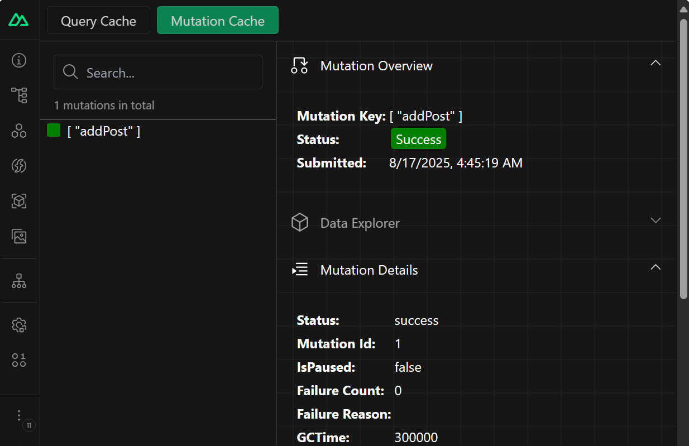

# Nuxt Query

[![npm version][npm-version-src]][npm-version-href]
[![npm downloads][npm-downloads-src]][npm-downloads-href]
[![License][license-src]][license-href]
[![Nuxt][nuxt-src]][nuxt-href]

A powerful Nuxt module for integrating [TanStack Query](https://tanstack.com/query/latest/docs/framework/vue/overview) (formerly Vue Query) into your Nuxt application. Provides robust server state management with intelligent caching, background updates, and seamless data synchronization.

- [✨ &nbsp;Release Notes](/CHANGELOG.md)
- [🏀 &nbsp;Online playground](https://stackblitz.com/github/peterbud/nuxt-query/tree/main/examples/minimal)

## Features

- ⚙️ &nbsp; Zero-configuration integration
- 💪 &nbsp; Full TypeScript support with Vue Query configuration
- 🏆 &nbsp; Advanced `QueryClient` setup with custom handlers via hooks
- 🤖 &nbsp; Configurable auto-imports for Vue Query composables
- 🧩 &nbsp; Nuxt DevTools integration for debugging and inspection

## Installation

You can add the module via the Nuxt CLI:

```bash
npx nuxi module add @peterbud/nuxt-query
```

or via npm:

```bash
npm install @peterbud/nuxt-query
```

## Configuration

To configure Nuxt Query, update your `nuxt.config.ts` specifying the options you want for Vue Query:

```typescript
// nuxt.config.ts
export default defineNuxtConfig({
  modules: ['@peterbud/nuxt-query'],
  nuxtQuery: {
    /**
     * Specify which Vue Query composables to auto-import
     * Default: `false`, set to `true` to auto-import all Vue Query composables
     */
    autoImports: ['useQuery', 'useMutation'],

    // Enable/disable Nuxt DevTools integration (default: true)
    devtools: true,

    /**
     * These are the same options as the QueryClient 
     * from @tanstack/vue-query, which will be passed 
     * to the QueryClient constructor
     * More details: https://tanstack.com/query/v5/docs/reference/QueryClient
     */
    
    queryClientOptions: {
      defaultOptions: {
        queries: {
          // for example disable refetching on window focus
          refetchOnWindowFocus: false,

          // or change the default refetch interval
          refetchInterval: 5000,
        },
      },
    },
  },
})
```

Then, in your component, you can define and run queries with the `useQuery` composable (auto-imported):

```vue
// app.vue
<script setup>
const getPosts = async () => {
  await new Promise(resolve => setTimeout(resolve, 2000))
  return await $fetch('https://jsonplaceholder.typicode.com/posts')
}

const { isPending, isFetching, isError, data, error } = useQuery({
  queryKey: ['posts'],
  queryFn: getPosts,
})
</script>
```

That's it! You can now use Nuxt Query in your Nuxt app ✨

## Module Hooks

Nuxt Query provides a hook that you can use in your application if you need a more complex setup for TanStack Query, such as a custom query client with centralized `onSuccess` or `onError` handlers, which would not be possible to configure with the options available in the `nuxt.config.ts`.

The hook is called `nuxt-query:configure` and you can use it in a plugin to return a custom `QueryClient` object in the following way:

```typescript
// plugins/nuxt-query.ts
import { QueryClient, QueryCache } from '@tanstack/vue-query'

export default defineNuxtPlugin({
  enforce: 'pre',
  setup(nuxtApp) {
    nuxtApp.hook('nuxt-query:configure', (getPluginOptions) => {
      const clientOptions = useRuntimeConfig().public.nuxtQuery?.queryClientOptions || {}

      const queryClient = new QueryClient({
        ...clientOptions,
        queryCache: new QueryCache({
          onSuccess: (data: unknown) => console.log('onSuccess', { data }),
        }),
      })

      // return the plugin options which will be used
      // by the module at startup
      getPluginOptions(queryClient)
    })
  },
})
```

## Nuxt DevTools Integration

Nuxt Query integrates with Nuxt DevTools to provide a dedicated tab for Vue Query, where you can inspect the state of your queries, view their cache, and properties, initiate refetch or remove certain queries and more.



Also, you can inspect your mutation cache using the same DevTools in a convenient way.



## Contribution

<details>
  <summary>Local development</summary>
  
  ```bash
  # Install dependencies
  npm install
  
  # Generate type stubs
  npm run dev:prepare
  
  # Develop with the playground
  npm run dev:client
  
  # Build the playground
  npm run dev:build
  
  # Run ESLint
  npm run lint
  
  # Run Vitest
  npm run test
  npm run test:watch
  
  # Build the module
  npm run build

  # Release new version
  npm run release
  ```

</details>

If you want to report a bug, please make sure you have a minimal reproduction of the issue. You can use the [minimal example](https://stackblitz.com/github/peterbud/nuxt-query/tree/main/examples/minimal?title=Nuxt-Query%20Minimal%20Example) to create a reproduction.

<!-- Badges -->
[npm-version-src]: https://img.shields.io/npm/v/@peterbud/nuxt-query/latest.svg?style=flat&colorA=020420&colorB=00DC82
[npm-version-href]: https://npmjs.com/package/@peterbud/nuxt-query

[npm-downloads-src]: https://img.shields.io/npm/dm/@peterbud/nuxt-query.svg?style=flat&colorA=020420&colorB=00DC82
[npm-downloads-href]: https://npm.chart.dev/@peterbud/nuxt-query

[license-src]: https://img.shields.io/npm/l/@peterbud/nuxt-query.svg?style=flat&colorA=020420&colorB=00DC82
[license-href]: https://npmjs.com/package/@peterbud/nuxt-query

[nuxt-src]: https://img.shields.io/badge/Nuxt-020420?logo=nuxt.js
[nuxt-href]: https://nuxt.com
